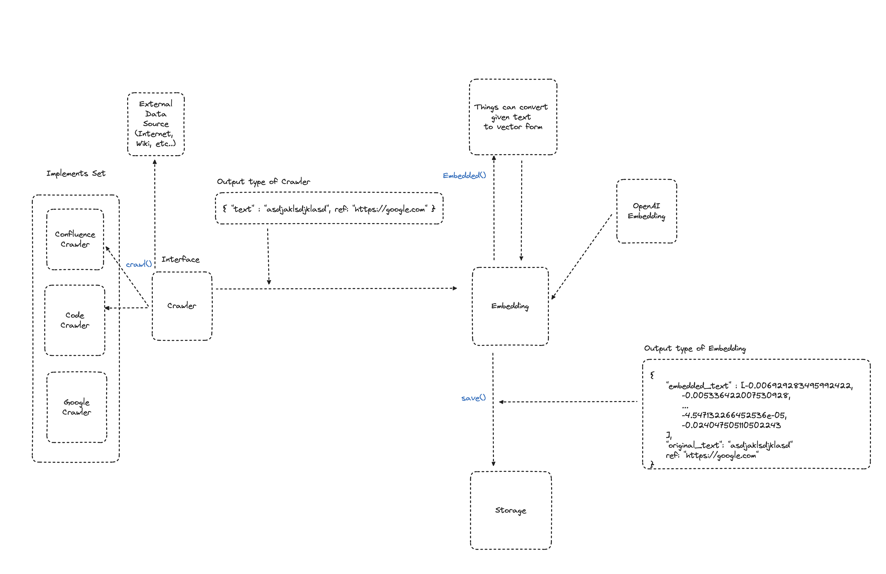
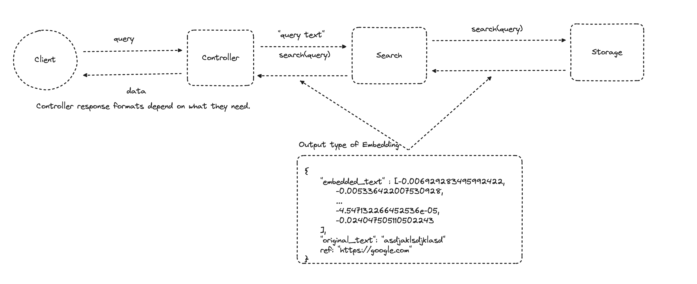

## Prequsites

1. Install dependencies using poetry

```bash
poetry install
```

2. Set environment variables

```bash
set -a
source .env
```

3. Add you openAI key to .env

## Introduction

This repository is a demo project for implementing a semantic search product.

## Architecture

The Below pictures briefly depict the architecture of this product. We have to do actions to implement a semantic-search product.

### Here's what we have to do

- **We crawl data from other External Sources.**
- **We have to convert data crawled into vector format using Embedding features.**
- **We should save the embedded data with reference to where the data from**
- **Client can semantically query to find data using this project**

### Crawl-To-Save



### Semnatically Query




